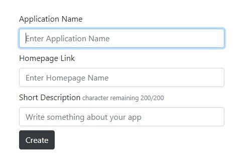
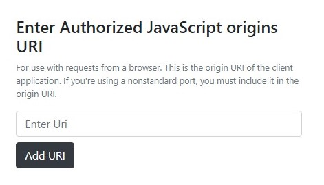
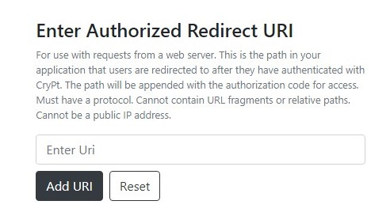
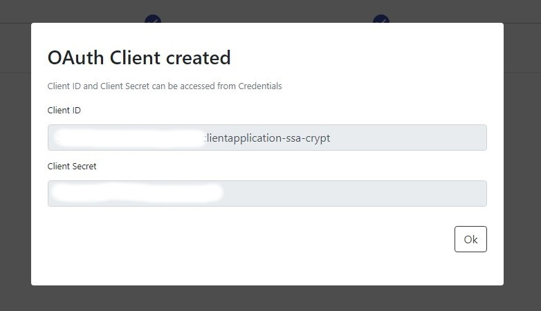

### Let's get started

[CryPt OAuth 2.0 service]('https://crypt-oauth.web.app') will require that you first register a new application, which also typically requires that you first sign up as a developer with us.[Click here to Signin]('https://crypt-oauth.web.app/login')

### Create An Apllication

The registration process involves creating an account on the service’s website,and then perform following steps.
- Click on New Application

- Select the type of Application

- Enter Name , Homepage Link and Description about application.

- Enter the JavaScript Origin

- Enter a Redirect URI 

#### Client ID and Client Secret

After performing all the Steps , Client Id and Client Secret is generated 

Client credentials can be  Accessed from Credentials Table in Dev Console.
These credentials are required while performing Oauth with our service.